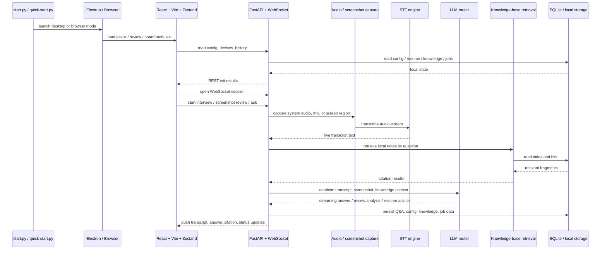

<div align="center">

[简体中文](README.md) · **English**

<pre>
██╗███╗   ██╗████████╗███████╗██████╗ ██╗   ██╗██╗███████╗██╗    ██╗
██║████╗  ██║╚══██╔══╝██╔════╝██╔══██╗██║   ██║██║██╔════╝██║    ██║
██║██╔██╗ ██║   ██║   █████╗  ██████╔╝██║   ██║██║█████╗  ██║ █╗ ██║
██║██║╚██╗██║   ██║   ██╔══╝  ██╔══██╗╚██╗ ██╔╝██║██╔══╝  ██║███╗██║
██║██║ ╚████║   ██║   ███████╗██║  ██║ ╚████╔╝ ██║███████╗╚███╔███╔╝
╚═╝╚═╝  ╚═══╝   ╚═╝   ╚══════╝╚═╝  ╚═╝  ╚═══╝  ╚═╝╚══════╝ ╚══╝╚══╝
 █████╗ ███████╗███████╗██╗███████╗████████╗ █████╗ ███╗   ██╗████████╗
██╔══██╗██╔════╝██╔════╝██║██╔════╝╚══██╔══╝██╔══██╗████╗  ██║╚══██╔══╝
███████║███████╗███████╗██║███████╗   ██║   ███████║██╔██╗ ██║   ██║
██╔══██║╚════██║╚════██║██║╚════██║   ██║   ██╔══██║██║╚██╗██║   ██║
██║  ██║███████║███████║██║███████║   ██║   ██║  ██║██║ ╚████║   ██║
╚═╝  ╚═╝╚══════╝╚══════╝╚═╝╚══════╝   ╚═╝   ╚═╝  ╚═╝╚═╝  ╚═══╝   ╚═╝
                The real-time copilot for technical interviews
</pre>

**Interview Assistant** — the smart interview-learning companion that listens in real time and drafts professional answers for you.

You focus on the question and your delivery; it handles transcription, answering, and screenshot-based question review. When you get stuck, a lightweight floating Q&A box stays close at hand. Built for real technical-interview scenarios: system-audio / microphone transcription, screenshot question review, multi-model switching, and knowledge-base references. The Electron desktop client adds share-stealth, a Boss Key, tray support, and a lightweight floating window, which avoids screen-share detection more reliably in most common interview software — but please test thoroughly against your own setup.

<p>
  <a href="desktop/package.json"></a>
  <a href="LICENSE"></a>
  <a href="backend/requirements.txt"></a>
  <a href="frontend/package.json"></a>
  <a href="frontend/package.json"></a>
  <a href="backend/requirements.txt"></a>
  <a href="desktop/package.json"></a>
</p>

<p>
  <a href="#capabilities"><strong>Capabilities</strong></a>
  ·
  <a href="#use-cases">Use cases</a>
  ·
  <a href="#quick-start">Quick start</a>
  ·
  <a href="#development-and-testing">Development</a>
  ·
  <a href="#repository-layout">Repository layout</a>
  ·
  <a href="#troubleshooting">Troubleshooting</a>
</p>

</div>

https://github.com/user-attachments/assets/1013b772-c59d-4ec4-8256-f932caa8ea3c

<p align="center">
  
  <br />
  <sub>The link above is the direct GitHub asset video that plays on the repository page; the GIF below is the static preview. The original video stays in <code>docs/screenshots/assist-demo.webm</code>.</sub>
</p>

## What's new (main branch)

Following v1.3.0, the interview chain keeps getting hardening fixes focused on state races and flow boundaries:

- Hardened interview chain state consistency to avoid races and drift in the real-time Q&A flow.
- Hardened written-exam generation, answering, and screenshot flows.
- Fixed speech-settings hydration clobbering the user's selection.
- Hardened written-exam preflight stale-state handling, job-tracker offer saves, and cancel-request timers.

## v1.3.0

v1.3.0 focuses on the written-exam mode and interview-flow stability:

- Added a written-exam preflight flow (sound check / environment self-check) before the exam starts, making question generation more stable.
- Practice mode now uses human portraits for the interviewer.
- LAN authentication is now opt-in for local development; enable it explicitly with `IA_AUTH_ENABLE=1` or `IA_AUTH_TOKEN` when needed.
- Candidate voice answers are persisted into knowledge-base history for richer ability analysis.
- Added a model-listing API and offer-edit guards; model capability probes and Think-mode probes are more robust.
- Detail improvements: compressed server screen captures, opt-in ASR interruption, and a hidden console window for quick-start launches on desktop.

## v1.2.0

v1.2.0 focuses on the desktop overlay experience and engineering:

- Rebuilt the Overlay: follows the main window state, prevents accidental interaction, visual redesign, shortcuts simplified to `Cmd+O` / `Cmd+M`.
- Polished interview prompts: intent ladder, resume dual-mode, first-sentence constraints, and high-churn follow-ups.
- Added structured stacked toasts with severity levels; split configStore into 6 slices and adopted `useShallow` selectors for rendering performance.

## v1.1.0

v1.1.0 expands job-search and resume capabilities and tunes the real-time pipeline:

- Job tracker now works in the browser: pipeline board, persisted in-column drag-and-drop ordering, stage dropdowns, and offer comparison.
- Resume upload history (last 10 entries, persisted even when parsing fails), preview / edit, and summary updates.
- Configurable server screen-capture region for vision-language models; refined screenshot coding prompts.
- Added a preflight sound-check for the interview chain; ASR segments are buffered and merged before transcription is published.
- Real-time assist prefers the top-bar priority model first, then the configured order; follow-up-context toggle and faster streaming.
- Added iFlytek (Xunfei) STT support; long-running memory management and resource cleanup.
- Visual and component polish (Neo-Industrial Dark), plus Dark+/Light+/high-contrast themes.

## v1.0.0

- First stable release with a complete workflow for real technical interviews.

## Capabilities

| Module | What it does |
| --- | --- |
| Real-time assist | System-audio / microphone transcription, automatic question detection, multi-model streaming answers, screenshot review, knowledge-base references, model health, and token stats. |
| Interview review | Records real Q&A, corrects ASR errors, analyzes question by question, and summarizes the session. |
| Ability analysis | Knowledge-point tags, Q&A history, and weak-point trends. |
| Knowledge base | Uploads `.md` / `.txt` / `.log` / `.docx` / `.pdf`; search testing, recent hits, and answer citations. |
| Resume optimizer | Uploads a resume and compares it against a JD for actionable suggestions and rewrites. |
| Job tracker | Table / Kanban, status tags, drag-and-drop sorting, and offer comparison. |
| Written-exam mode | Preflight sound check, question generation, answering, and screenshot flows shared with real-time assist. |
| Desktop | Electron client with share stealth, Boss Key, tray, floating Q&A window, global shortcuts, and move-to-mouse. |
| Settings | Model management, STT engines, themes, preferences, shortcuts, and capture regions. |

## Use cases

- Real technical interviews: listen, transcribe, and draft professional answers; the floating box steps in when you stall.
- Online written exams / coding assessments: written-exam mode plus screenshot review so models can analyze questions and code.
- Multi-device collaboration: LAN browser mode with a QR code — watch on your phone while audio is captured on the computer.
- Personal material: upload a resume and compare it against a JD so answers reflect your actual experience.
- Review and growth: interview review, knowledge-point analysis, job tracker, and offer comparison.

## The main interview flow

1. Choose system audio or microphone, then press start.
2. Live transcription streams on the left while the system detects questions worth answering.
3. The answer panel streams a formal answer on the right using the current model configuration.
4. To review a figure, paste a screenshot and let the model analyze the question, code snippet, or page content.
5. With the knowledge base enabled, citation badges appear above answers, linking your local notes or material.
6. When space is tight, use `⌘⇧J / Ctrl+Shift+J` to collapse the live transcription panel and let the answer area fill the screen.
7. In desktop mode, pair it with share stealth, the Boss Key, and the floating prompt window — but interview software varies, so always test thoroughly yourself.

## Main UI at a glance

<p align="center">
  
</p>

## Capability radar

<table>
  <tr>
    <td width="50%" valign="top">
      <h3>Real-time assist</h3>
      <p>ASR transcription, question detection, streaming answers, screenshot review, knowledge-base references, model health, and token stats.</p>
    </td>
    <td width="50%" valign="top">
      <h3>Desktop</h3>
      <p>Electron client with share stealth, Boss Key, tray, floating Q&A window, and shortcuts to minimize main-UI exposure.</p>
    </td>
  </tr>
  <tr>
    <td width="50%" valign="top">
      <h3>Practice &amp; review</h3>
      <p>Interview review, Q&amp;A records, ability analysis, and weak-point capture so answered questions become talking points.</p>
    </td>
    <td width="50%" valign="top">
      <h3>Job material</h3>
      <p>Resume upload and summaries, JD comparison, job tracker, and offer comparison — all pre- and post-interview steps in one tool.</p>
    </td>
  </tr>
</table>

## Module gallery

<table>
  <tr>
    <td width="50%"></td>
    <td width="50%"></td>
  </tr>
  <tr>
    <td align="center"><strong>Ability analysis</strong><br /><sub>Knowledge trends, Q&amp;A history, weak-point review</sub></td>
    <td align="center"><strong>Resume optimizer</strong><br /><sub>Put resume and JD together, output a version that is ready to send</sub></td>
  </tr>
</table>

## Architecture



### Tech stack

| Layer | Technology |
| --- | --- |
| **Frontend** | React 18 · TypeScript · Vite · Zustand · Tailwind CSS · Playwright |
| **Backend** | Python 3.10+ · FastAPI · Uvicorn · WebSocket |
| **Speech** | faster-whisper · Doubao (Volcengine) · generic ASR (OpenAI-compatible) |
| **LLM** | OpenAI-compatible · multi-model parallel · Think reasoning · vision |
| **Storage** | SQLite · local resume history · knowledge-base index |
| **Desktop** | Electron |

## Quick start

### 1. Requirements

- Python `3.10+`
- Node.js `18+`

### 2. Install dependencies

```bash
git clone https://github.com/powAu3/interview-assistant.git
cd interview-assistant

pip install -r backend/requirements.txt

cd frontend
npm install
npm run build
cd ..

cp backend/config.example.json backend/config.json
```

### 3. Configure models

- Edit `backend/config.json`.
- Fill in the model API key / base URL / model name you want to use.
- Configure vision, knowledge base, and Doubao speech recognition here too if needed.

Reference docs (currently maintained in Simplified Chinese):

- [配置说明 (Configuration)](docs/配置说明.md)
- [API 密钥与模型 (API keys and models)](docs/API密钥与模型.md)
- [音频配置 (Audio configuration)](docs/音频配置.md)
- [Moonlight 链路部署 (Moonlight deployment)](docs/Moonlight链路部署.md)
- [豆包语音识别 (Doubao speech recognition)](docs/豆包语音识别.md)

### 4. Launch

```bash
python start.py                 # desktop mode (recommended)
python start.py --mode network  # browser mode, default http://localhost:18080
```

Notes:

- On first launch, if the frontend is not built yet, `start.py` installs and builds it automatically, so Node.js is still required locally.
- `python quick-start.py` suits the case where the frontend is already built and you want to open desktop mode quickly.
- To try it in a browser only, use `--mode network`.
- On Windows you can double-click `启动.bat`: the console window hides after 1 second and the Electron window opens automatically.

## Requirements

- Windows 10 version 1809 (build 17763) or later, 64-bit, for desktop mode.
- Python 3.10+ and Node.js 18+ when running from source.
- System-audio transcription relies on WASAPI loopback capture; microphone transcription needs a working recording device.
- A local GPU or a remote API is recommended to speed up Whisper transcription.

## Development and testing

```bash
cd frontend && npm run dev
cd backend && python -m uvicorn main:app --host 127.0.0.1 --port 18080 --reload
```

Dev-mode note: running the backend locally does not enable auth by default, so the `npm run dev` Vite proxy can reach `http://localhost:18080` directly. Requests require a token only under `python start.py --mode network`, `IA_AUTH_ENABLE=1`, or when `IA_AUTH_TOKEN` is set.

## Regenerating README assets

```bash
cd frontend
npx playwright install chromium   # required on first run
npm run screenshots:readme
npm run demo:readme
```

Outputs go to `docs/screenshots/`:

- `assist-demo.webm`: raw main-flow video
- `assist-demo-poster.png`: video poster
- `assist-demo.gif`: the GIF actually used at the top of this README
- `assist-mode.png`: real-time assist UI
- `knowledge-map.png`: ability analysis
- `resume-optimizer.png`: resume optimizer

See [docs/screenshots/README.md](docs/screenshots/README.md) for details.

## Repository layout

```text
interview-assistant/
├── start.py                   # unified launcher: deps check / frontend build / desktop or network mode
├── quick-start.py             # quick desktop start when the frontend is already built
├── 启动.bat                   # one-click Windows launch
├── backend/
│   ├── main.py                # FastAPI entry (uvicorn main:app)
│   ├── api/                   # per-tab packages (realtime / assist / analytics / resume / jobs)
│   ├── core/                  # config.py, session.py
│   ├── services/              # stt / llm / audio / resume / storage / capture
│   ├── data/                  # runtime SQLite (knowledge.db, job_tracker.db)
│   └── config.example.json    # config template
├── frontend/
│   ├── src/                   # React 18 + TypeScript + Vite + Zustand
│   ├── scripts/               # README screenshot and demo generation
│   └── package.json
├── desktop/                   # Electron desktop (share stealth / Boss Key / tray / overlay)
├── docs/                      # configuration, audio, Doubao STT, Moonlight docs
└── CHANGELOG.md               # fix log
```

## Local data, logging, and troubleshooting

Runtime data and configuration live in `backend/data/` and `backend/config.json`:

| Path | Purpose |
| --- | --- |
| `backend/config.json` | Models, STT engines, knowledge base, capture region, and parameters (copy from `config.example.json`). |
| `backend/data/knowledge.db` | Knowledge-base index and hit records. |
| `backend/data/job_tracker.db` | Job-tracker and offer data. |
| `log/` | Launcher and local ntfy service logs. |

Structured logs record transcription, answers, and errors end to end to help troubleshoot the real-time pipeline.

Common issues:

- **Node / npm errors**: make sure Node.js is `18+`.
- **Slow Electron download**: set `ELECTRON_MIRROR=https://npmmirror.com/mirrors/electron/`, then run `npm install` inside `desktop/`.
- **sounddevice install failure on macOS**: run `brew install portaudio` first.
- **Slow Whisper model download**: set `export HF_ENDPOINT=https://hf-mirror.com`.
- **Port conflict**: use `python start.py --port 9090` instead.
- **No transcription text**: make sure the selected audio device works; system audio needs WASAPI loopback capture. Run the sound check in Settings first.
- **Phone cannot reach the LAN page**: make sure the phone and computer share the same Wi-Fi and the computer firewall is not blocking the port.

## License and disclaimer

- **License**: [CC BY-NC 4.0](https://creativecommons.org/licenses/by-nc/4.0/)
- **Disclaimer**: this project is for learning and research only. Do not use it for academic misconduct, cheating on examinations, or any other non-compliant scenario; you are responsible for how you use it.