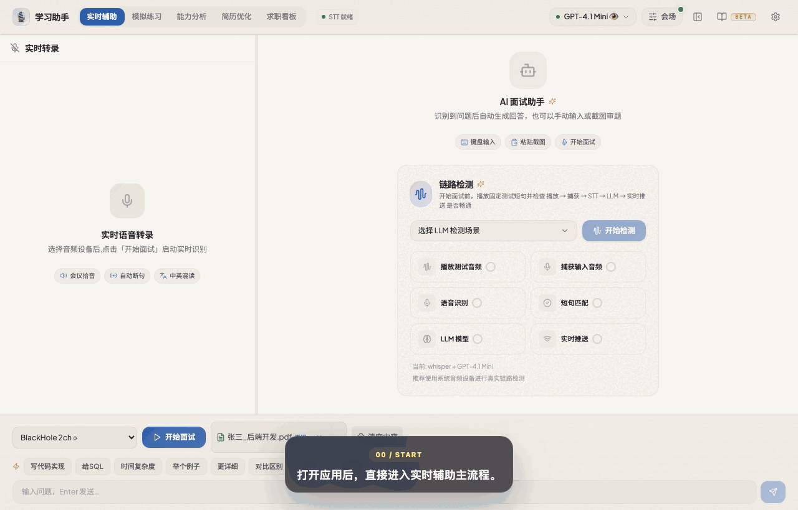
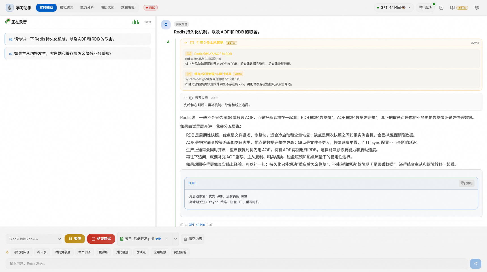
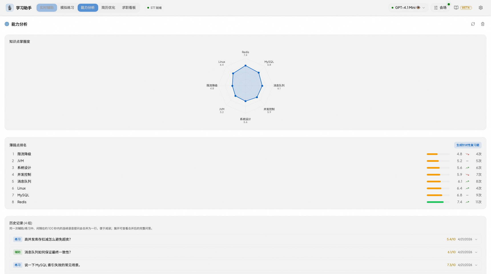
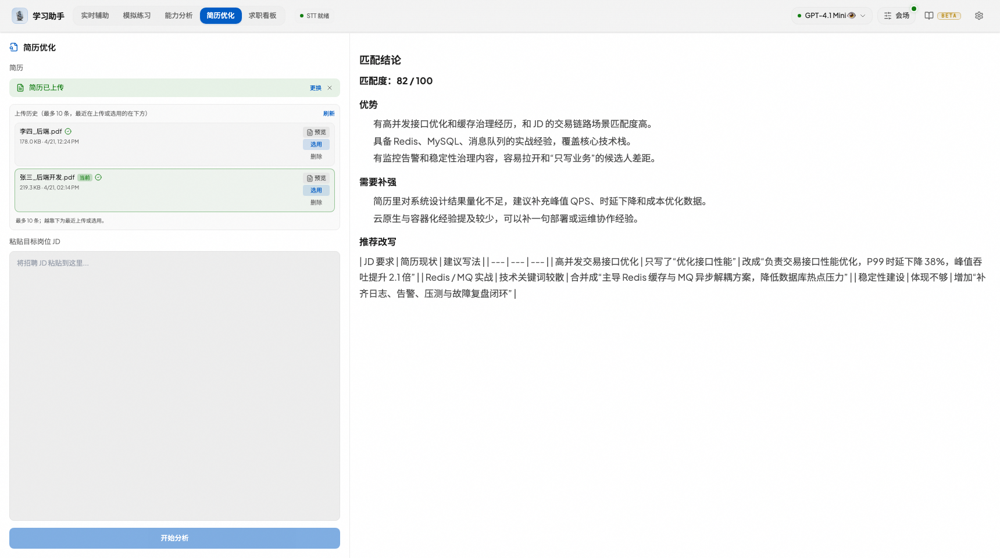
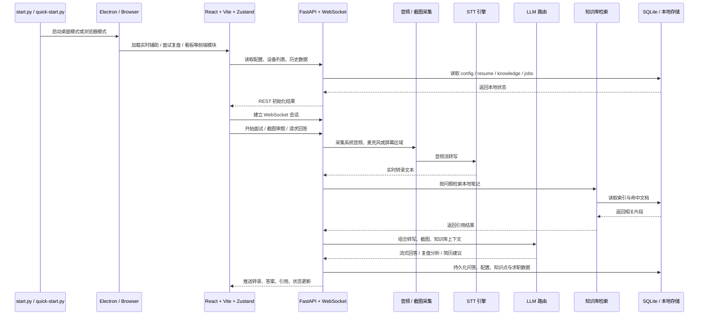

<div align="center">

**简体中文** · [English](README.en.md)

<pre>
██╗███╗   ██╗████████╗███████╗██████╗ ██╗   ██╗██╗███████╗██╗    ██╗
██║████╗  ██║╚══██╔══╝██╔════╝██╔══██╗██║   ██║██║██╔════╝██║    ██║
██║██╔██╗ ██║   ██║   █████╗  ██████╔╝██║   ██║██║█████╗  ██║ █╗ ██║
██║██║╚██╗██║   ██║   ██╔══╝  ██╔══██╗╚██╗ ██╔╝██║██╔══╝  ██║███╗██║
██║██║ ╚████║   ██║   ███████╗██║  ██║ ╚████╔╝ ██║███████╗╚███╔███╔╝
╚═╝╚═╝  ╚═══╝   ╚═╝   ╚══════╝╚═╝  ╚═╝  ╚═══╝  ╚═╝╚══════╝ ╚══╝╚══╝
 █████╗ ███████╗███████╗██╗███████╗████████╗ █████╗ ███╗   ██╗████████╗
██╔══██╗██╔════╝██╔════╝██║██╔════╝╚══██╔══╝██╔══██╗████╗  ██║╚══██╔══╝
███████║███████╗███████╗██║███████╗   ██║   ███████║██╔██╗ ██║   ██║
██╔══██║╚════██║╚════██║██║╚════██║   ██║   ██╔══██║██║╚██╗██║   ██║
██║  ██║███████║███████║██║███████║   ██║   ██║  ██║██║ ╚████║   ██║
╚═╝  ╚═╝╚══════╝╚══════╝╚═╝╚══════╝   ╚═╝   ╚═╝  ╚═╝╚═╝  ╚═══╝   ╚═╝
                The real-time copilot for technical interviews
</pre>

**智能面试学习辅助助手** —— 实时听题，自动生成专业面试回答。

你负责听题和临场反应，它负责转写、答题、截图审题；卡壳的时候还能把问答框挂在旁边。面向真实技术面试场景：支持系统音频 / 麦克风转写、截图审题、多模型切换、知识库引用；Electron 端提供共享隐身、Boss Key、托盘和轻量悬浮窗，绝大多数常见面试软件场景下都能更稳地避开屏幕共享检测，但具体效果仍建议自行充分实测。

<p>
  <a href="desktop/package.json"></a>
  <a href="LICENSE"></a>
  <a href="backend/requirements.txt"></a>
  <a href="frontend/package.json"></a>
  <a href="frontend/package.json"></a>
  <a href="backend/requirements.txt"></a>
  <a href="desktop/package.json"></a>
</p>

<p>
  <a href="#能力概览"><strong>功能概览</strong></a>
  ·
  <a href="#适用场景">适用场景</a>
  ·
  <a href="#快速开始">快速开始</a>
  ·
  <a href="#开发与自测">开发与自测</a>
  ·
  <a href="#项目结构">源码结构</a>
  ·
  <a href="#常见问题">常见问题</a>
</p>

</div>

https://github.com/user-attachments/assets/1013b772-c59d-4ec4-8256-f932caa8ea3c

<p align="center">
  
  <br />
  <sub>上面是 GitHub 附件视频直链，可在仓库页直接播放；下方保留 GIF 作为静态预览，仓库内原始视频文件仍保留在 <code>docs/screenshots/assist-demo.webm</code>。</sub>
</p>

## 最新动态（main 分支）

v1.3.0 之后继续对面试链路做一致性加固，重点收敛状态竞态与流程边界：

- 面试链路状态一致性加固，避免实时问答流程中的竞态与失步。
- 笔试模式生成流程加固，笔试作答与截图流程更稳定。
- 修复语音设置水合时覆盖用户选择的问题。
- 笔试考前自检忽略过期状态，招聘看板 Offer 保存、取消请求计时器等细节同步加固。

## v1.3.0

v1.3.0 主要围绕笔试模式与面试主流程稳定性：

- 新增笔试模式考前 preflight（试音 / 环境自检）流程，笔试题目生成链路更稳定。
- 练习模式面试官切换为真人头像。
- 局域网鉴权改为默认关闭（本地开发免 token），需要时通过 `IA_AUTH_ENABLE=1` 或 `IA_AUTH_TOKEN` 显式开启。
- 候选人语音回答写入知识库历史，能力分析沉淀更完整。
- 新增模型列表接口与 Offer 编辑保护；模型能力探针、Think 思考开关探测更稳。
- 服务端截图压缩、ASR 中断改为可选、桌面端快捷启动隐藏控制台窗口等细节优化。

## v1.2.0

v1.2.0 主要围绕桌面悬浮窗体验与工程化：

- 悬浮窗（Overlay）重构：跟随主界面状态、防误触、视觉重设计，快捷键精简为 `Cmd+O` / `Cmd+M`。
- 面试提示词打磨：意图阶梯、简历双模式、首句约束与高频追问。
- 新增结构化 Toast 堆叠与分级；configStore 拆分为 6 个切片并采用 `useShallow` 选择器优化渲染性能。

## v1.1.0

v1.1.0 主要扩充求职与简历能力，并优化实时链路：

- 求职看板支持 Web 端，管道看板、列内拖拽排序持久化、阶段下拉与 Offer 对比。
- 简历上传历史（最近 10 条、落盘、解析失败也保留）、预览 / 编辑与摘要更新。
- 服务端屏幕截图区域可配置，适配 VL 识图模型；截图代码提示词优化。
- 新增面试前链路试音检测；ASR 片段缓冲合并后再发布转写。
- 实时辅助优先顶栏「优先模型」再按配置顺序；追问上下文开关与流式生成加速。
- 新增讯飞 STT 支持；长时间运行的内存管理与资源清理。
- 界面视觉与组件美化（Neo-Industrial Dark），新增 Dark+/Light+/高对比配色。

## v1.0.0

- 首个正式版本，面向真实技术面试场景的完整工作流。

## 能力概览

| 模块 | 能力 |
| --- | --- |
| 实时辅助 | 系统音频 / 麦克风转写、自动识别问题、多模型流式回答、截图审题、知识库引用、模型健康与 Token 统计。 |
| 面试复盘 | 录制真实问答、ASR 纠错、逐题分析、整场总结，把"答过的问题"沉淀成"会讲的话题"。 |
| 能力分析 | 知识点标签、历史问答记录、薄弱点趋势。 |
| 知识库 | 上传 `.md` / `.txt` / `.log` / `.docx` / `.pdf`，支持检索测试、最近命中与回答引用。 |
| 简历优化 | 上传简历，对照 JD 给出优化建议与改写方向，输出更像"能投出去"的版本。 |
| 求职看板 | 表格 / Kanban、状态标签、拖拽排序、Offer 对比。 |
| 笔试模式 | 考前试音自检、题目生成、作答与截图流程，与实时辅助共用一套链路。 |
| 桌面协同 | Electron 端提供共享隐身、Boss Key、托盘、悬浮问答框、全局快捷键与移动到鼠标附近。 |
| 设置中心 | 模型管理、STT 引擎、主题、偏好、快捷键、截图区域等配置。 |

## 适用场景

- 真实技术面试：听题、转写、自动生成专业回答，卡壳时悬浮问答框补位。
- 在线笔试 / 编码考核：笔试模式 + 截图审题，把题目和代码片段交给模型分析。
- 多设备协同：局域网浏览器模式 + 二维码，手机上看界面、电脑端采集音频。
- 个人材料接入：简历上传、JD 对照优化，让答案更贴近你的经历。
- 复盘与提升：面试复盘、知识点能力分析、求职看板与 Offer 对比。

## 面试主流程

1. 选择系统音频或麦克风，点击开始。
2. 左侧实时转写持续落字，系统自动识别"值得回答"的问题。
3. 右侧答案区按当前模型配置流式生成正式回答。
4. 需要审图时，可粘贴截图，把题目、代码片段或页面内容交给模型分析。
5. 开启知识库后，答案上方会显示引用角标，关联你的本地笔记或资料。
6. 空间紧张时，可用 `⌘⇧J / Ctrl+Shift+J` 折叠左侧实时转录面板，让回答区铺满。
7. 使用桌面模式时，还可以配合共享隐身、Boss Key 和悬浮提示窗一起使用，但不同面试软件策略不同，请务必自行充分实测。

## 主界面速览

<p align="center">
  
</p>

## 关键能力雷达

<table>
  <tr>
    <td width="50%" valign="top">
      <h3>实时辅助</h3>
      <p>ASR 转写、自动识别问题、流式回答、截图审题、知识库引用、模型健康与 Token 统计。</p>
    </td>
    <td width="50%" valign="top">
      <h3>桌面协同</h3>
      <p>Electron 端提供共享隐身、Boss Key、托盘、悬浮问答框和快捷键，尽量减少主界面暴露。</p>
    </td>
  </tr>
  <tr>
    <td width="50%" valign="top">
      <h3>训练与复盘</h3>
      <p>面试复盘、问答记录、能力分析和薄弱点沉淀，方便把"答过的问题"变成"会讲的话题"。</p>
    </td>
    <td width="50%" valign="top">
      <h3>求职材料</h3>
      <p>简历上传与摘要、JD 对照优化、求职看板、Offer 对比，把面试前后动作收在一个工具里。</p>
    </td>
  </tr>
</table>

## 模块画廊

<table>
  <tr>
    <td width="50%"></td>
    <td width="50%"></td>
  </tr>
  <tr>
    <td align="center"><strong>能力分析</strong><br /><sub>知识点趋势、问答沉淀、薄弱项复盘</sub></td>
    <td align="center"><strong>简历优化</strong><br /><sub>把简历和 JD 放到一起，输出更像"能投出去"的版本</sub></td>
  </tr>
</table>

## 技术结构



### 技术栈

| 层 | 技术 |
| --- | --- |
| **前端** | React 18 · TypeScript · Vite · Zustand · Tailwind CSS · Playwright |
| **后端** | Python 3.10+ · FastAPI · Uvicorn · WebSocket |
| **语音识别** | faster-whisper · 豆包 (Volcengine) · 通用 ASR (OpenAI-compatible) |
| **LLM** | OpenAI 兼容接口 · 多模型并行 · Think 推理 · 识图 |
| **存储** | SQLite · 本地简历历史 · 知识库索引 |
| **桌面** | Electron |

## 快速开始

### 1. 准备环境

- Python `3.10+`
- Node.js `18+`

### 2. 安装依赖

```bash
git clone https://github.com/powAu3/interview-assistant.git
cd interview-assistant

pip install -r backend/requirements.txt

cd frontend
npm install
npm run build
cd ..

cp backend/config.example.json backend/config.json
```

### 3. 配置模型

- 编辑 `backend/config.json`
- 填入你要使用的模型 API Key / Base URL / 模型名
- 如果要启用识图、知识库、豆包语音识别，也在这里一并配置

参考文档：

- [配置说明](docs/配置说明.md)
- [API 密钥与模型](docs/API密钥与模型.md)
- [音频配置](docs/音频配置.md)
- [Moonlight 链路部署](docs/Moonlight链路部署.md)
- [豆包语音识别](docs/豆包语音识别.md)

### 4. 启动应用

```bash
python start.py                 # 桌面模式（推荐）
python start.py --mode network  # 浏览器模式，默认 http://localhost:18080
```

补充说明：

- 首次启动如果前端尚未构建，`start.py` 会自动安装并构建前端，因此本机仍需要 Node.js。
- `python quick-start.py` 适合已经构建过前端、想快速打开桌面模式的场景。
- 只想在浏览器里体验时，可直接用 `--mode network`。
- Windows 上双击 `启动.bat` 即可：命令行窗口会在 1 秒后自动隐藏，Electron 桌面窗口自动打开。

## 运行要求

- Windows 10 1809（17763）或更高版本，64 位系统（桌面模式）。
- Python 3.10+ 与 Node.js 18+（源码运行）。
- 系统音频转写依赖 WASAPI 回环采集；麦克风转写依赖可用录音设备。
- 建议使用本地 GPU 或远端 API 加速 Whisper 转写。

## 开发与自测

```bash
cd frontend && npm run dev
cd backend && python -m uvicorn main:app --host 127.0.0.1 --port 18080 --reload
```

开发模式提示：本地直接跑后端时默认不启用鉴权，`npm run dev` 的 Vite 代理可以直接访问
`http://localhost:18080`。只有 `python start.py --mode network`、`IA_AUTH_ENABLE=1`
或设置了 `IA_AUTH_TOKEN` 时，才会要求局域网请求携带 token。

## README 素材更新

```bash
cd frontend
npx playwright install chromium   # 首次执行需要
npm run screenshots:readme
npm run demo:readme
```

生成结果会输出到 `docs/screenshots/`：

- `assist-demo.webm`：主流程原始视频素材
- `assist-demo-poster.png`：视频封面
- `assist-demo.gif`：README 顶部实际使用的 GIF 演示
- `assist-mode.png`：实时辅助界面
- `knowledge-map.png`：能力分析
- `resume-optimizer.png`：简历优化

更多说明见 [docs/screenshots/README.md](docs/screenshots/README.md)。

## 项目结构

```text
interview-assistant/
├── start.py                   # 统一启动器：依赖检查 / 前端构建 / 桌面或网络模式
├── quick-start.py             # 已构建前端的快速桌面启动
├── 启动.bat                   # Windows 一键启动
├── backend/
│   ├── main.py                # FastAPI 入口（uvicorn main:app）
│   ├── api/                   # 按前端 Tab 分子包（realtime / assist / analytics / resume / jobs）
│   ├── core/                  # config.py、session.py
│   ├── services/              # stt / llm / audio / resume / storage / capture
│   ├── data/                  # 运行时 SQLite（knowledge.db、job_tracker.db）
│   └── config.example.json    # 配置模板
├── frontend/
│   ├── src/                   # React 18 + TypeScript + Vite + Zustand
│   ├── scripts/               # README 截图与演示素材生成
│   └── package.json
├── desktop/                   # Electron 桌面端（共享隐身 / Boss Key / 托盘 / 悬浮窗）
├── docs/                      # 配置、音频、豆包 STT、Moonlight 链路等文档
└── CHANGELOG.md               # 修复日志
```

## 配置、日志与故障排查

运行时数据与配置位于 `backend/data/` 与 `backend/config.json`：

| 路径 | 用途 |
| --- | --- |
| `backend/config.json` | 模型、STT 引擎、知识库、截图区域与各项参数（从 `config.example.json` 复制）。 |
| `backend/data/knowledge.db` | 知识库索引与命中记录。 |
| `backend/data/job_tracker.db` | 求职看板与 Offer 数据。 |
| `log/` | 启动器与本地 ntfy 服务日志。 |

结构化日志记录转录、回答与错误全流程，便于排查实时链路问题。

常见问题：

- **Node / npm 报错**：请确认 Node.js 版本为 `18+`。
- **Electron 下载慢**：可先设置 `ELECTRON_MIRROR=https://npmmirror.com/mirrors/electron/`，再进入 `desktop/` 执行 `npm install`。
- **macOS 下 sounddevice 安装失败**：先执行 `brew install portaudio`。
- **Whisper 模型下载慢**：可设置 `export HF_ENDPOINT=https://hf-mirror.com`。
- **端口冲突**：可改用 `python start.py --port 9090`。
- **转写一直没字**：确认选择的音频设备可用，系统音频需要 WASAPI 回环采集支持；可在设置里先做试音检测。
- **局域网手机访问失败**：确认手机与电脑在同一 WiFi，且电脑未开启防火墙拦截。

## 开源协议与免责

- **协议**：[CC BY-NC 4.0](https://creativecommons.org/licenses/by-nc/4.0/)
- **免责**：项目仅供学习研究，请勿用于学术不端、违规考试或其他不合规场景；使用后果自行承担。
